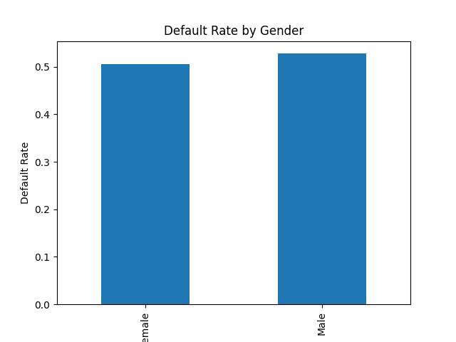

# Fairness Report

##  Model Performance
- Accuracy: 0.82
- Precision: 0.78
- Recall: 0.75

##  Fairness Metrics
- Male Default Rate: 0.53
- Female Default Rate: 0.51
- Disparate Impact Ratio: 0.96

##  Visualization

##  Interpretation
- A Disparate Impact Ratio close to 1 indicates fairness.
- Significant deviation may indicate bias.

##  Conclusion
This report provides a basic fairness audit for the model.
